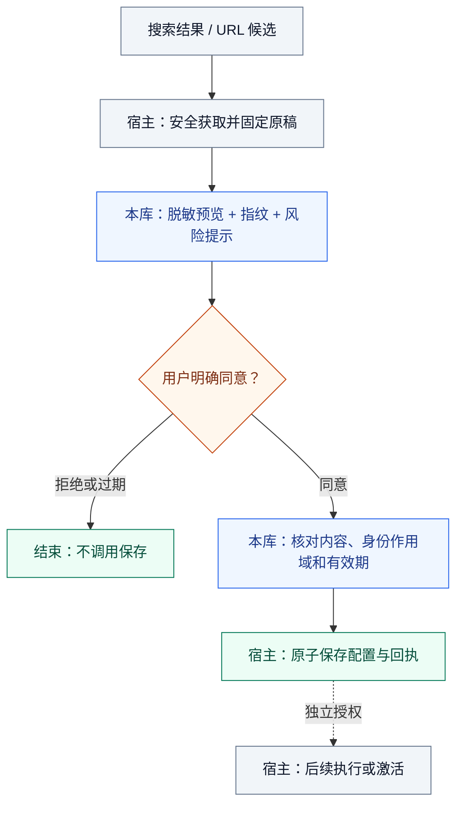
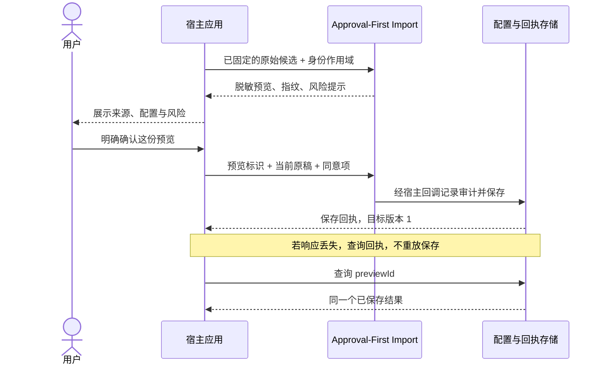

# Approval-First Import

[中文](./README.md) | [English](./README_EN.md)

Approval-First Import 是一个零依赖的 Node.js 库，用于在应用保存不受信任的 Skill 或 MCP 配置前建立明确、可审计的用户确认门。它提供内容绑定的审批、脱敏预览、风险提示、有效期、作用域绑定和单次确认。

项目解决的核心问题不是“怎样安装得更快”，而是“怎样让用户在保存外部能力前真正知道将发生什么”。搜索结果不会自动变成草稿，预览不会写入文件，保存后的配置也不会被本库执行。

## 适用场景

第三方 Agent 能力导入跨越了多个信任边界：

- 搜索元数据不等于可安装配置。
- 预览不等于用户同意。
- 同意应绑定到确定内容和作用域，而不是可能变化的 URL。
- 保存配置不等于授权执行命令。
- 高风险命令需要额外确认。
- 保存失败或状态不明时，旧审批不能被自动重放。

Approval-First Import 把这些边界固化为宿主应用可复用的状态机。

## 安全流程



执行始终是单独的操作和授权，本库不会运行外部命令。

## 快速开始

要求 Node.js 22 或更高版本。取得仓库后，运行示例无需安装依赖、配置模型密钥、访问网络或构建。

```bash
git clone https://github.com/liulinlin718-netizen/approval-first-import.git
cd approval-first-import

node bin/approval-first-import.js demo
node bin/approval-first-import.js preview examples/skill.json
node bin/approval-first-import.js preview examples/mcp-high-risk.json
```

CLI 只输出预览，不提供保存、安装、确认或 shell 命令。完整确认流程应集成在可信后端中。

## 看一次完整导入

本库没有图形界面。下面使用[可运行宿主演示](./examples/host-demo.js)展示真实合成输出，不是应用截图。

```bash
node examples/host-demo.js
```

该演示在仓库内创建临时存储，完成合成确认和保存后重新读取回执，最后清理自己的文件。它不联网，也不执行配置中声明的命令。



演示输出中的关键字段如下；随机标识、指纹和时间戳未在表中展开：

| 阶段 | 输出字段 | 实际值 | 含义 |
| --- | --- | --- | --- |
| 预览 | `preview.candidate.name` | `Synthetic notes` | 合成 MCP 配置 |
| 预览 | `preview.candidate.env.NOTES_TOKEN` | `[REDACTED]` | 原始凭据不进入公开视图 |
| 预览 | `preview.requiresConfirmation` | `true` | 保存前需要明确同意 |
| 预览 | `preview.willWrite` / `preview.willExecute` | `false` / `false` | 预览不写入、不执行 |
| 保存后 | `saved.value.version` | `1` | 宿主保存了第一个配置版本 |
| 重读存储 | `afterRestart.value.version` | `1` | 查询已有回执，不再次写入 |

用户不同意时，不调用保存；原稿变化、预览过期或风险未确认时，旧预览不能继续授权。接入步骤和生产存储边界见[宿主接入说明](./docs/host-integration.md)。

## 集成示例

```js
import { ImportApprovalGate } from './src/index.js';

const gate = new ImportApprovalGate({
  ttlMs: 5 * 60_000,
  recordDecision: async decision => auditStore.append(decision),
});

// 由可信宿主在安全抓取并固定内容后构建。
const draft = {
  kind: 'mcp',
  name: 'Notes',
  source: {
    url: 'https://example.org/notes',
    revision: 'pinned-revision',
  },
  destination: 'config/notes.json',
  transport: 'stdio',
  commands: [{ executable: 'node', args: ['notes-server.mjs'] }],
  env: { NOTES_TOKEN: 'user-supplied-value' },
};

const scope = JSON.stringify([authenticatedUser.id, workspace.id]);
const preview = gate.preview(draft, { scope });

// 仅将脱敏预览发送到 UI，原始 draft 留在服务端。
const receipt = await gate.confirmAndSave({
  previewId: preview.previewId,
  fingerprint: preview.fingerprint,
  scope,
  candidate: currentHostDraft,
  confirmed: userForm.confirmed === true,
  acknowledgeHighRisk: userForm.acknowledgeHighRisk === true,
}, async (approved, decision) => {
  return configStore.saveAtomically(decision.previewId, approved);
});
```

身份认证、CSRF 防护、审计存储、内容抓取与原子持久化由宿主应用负责。模型生成的 `confirmed: true` 不代表人类同意。

上面的片段依赖宿主提供的认证、审计和存储服务。可以从[宿主适配器](./examples/host-adapter.js)与[单进程文件存储示例](./examples/host-store.js)了解这些服务如何配合；示例存储不是生产数据库。

## 安全契约

每个预览固定包含：

```json
{
  "requiresConfirmation": true,
  "willWrite": false,
  "willExecute": false
}
```

审批会绑定规范化候选内容、来源 URL 与固定 revision、目标文件、结构化命令、隐藏的环境变量与请求头、用户/工作区作用域、预览有效期和单次状态。任何关键变化都会使旧审批失效。

保存回调获得的是冻结的原始候选，而不是从公开预览反向拼装的对象。

## 公开 API

| 操作 | 作用 |
| --- | --- |
| `discoveryCandidate(input)` | 只校验发现元数据，不抓取内容、不构造命令。 |
| `new ImportApprovalGate(options?)` | 创建有边界的内存审批注册表。 |
| `gate.preview(candidate, { scope })` | 创建冻结的脱敏预览和内容指纹。 |
| `gate.confirmAndSave(request, save, { signal }?)` | 核对同意、内容、作用域、有效期和风险确认后调用一次保存；支持协作式取消。 |
| `gate.status(previewId, { scope })` | 查询当前审批状态。 |
| `gate.revoke(previewId, { scope })` | 撤销待确认审批。 |

候选支持多文件文本 Skill，以及使用结构化 stdio 命令或 HTTP/SSE 端点的 MCP 配置。未知字段、访问器、循环引用、原型键、超大值和不安全的可移植目标路径会被拒绝。

## 脱敏与风险提示

公开预览会隐藏环境变量和请求头值、URL 查询参数和 fragment、常见凭据参数、Bearer 值及疑似凭据文件内容；空的必填值显示为 `[REQUIRED]`。

风险扫描覆盖命令声明、shell/内联代码、远程脚本管道、破坏性命令、生命周期脚本、权限变更和可执行资源。所有外部导入至少为 `medium` 风险；`high` 需要额外确认，但仍不会授予执行权限。

脱敏是保守防线，不是完整密钥扫描器或恶意代码检测器。导入内容应始终按文本渲染，不能作为可信 HTML。

脱敏只匹配原文，不重复替换占位符。候选上限为 512 KiB，每个脱敏字段上限 256 KiB，完整预览上限 1 MiB；另有扫描工作量限制。超过预算会拒绝预览，不截断成可确认的包。过短的敏感值可能遮住来源或命令文本，预览会明确提示。

## 状态模型与宿主责任

```text
pending → confirming → saving → saved
   │           │           └→ failed / save_unknown
   │           ├→ expired / revoked / failed
   └→ expired / revoked
```

并发确认不能重复调用保存回调。保存失败会消耗审批，因为可能已经发生部分写入；系统不自动重试或回滚。

审计默认最多等待 10 秒，且不超过预览剩余有效期；保存默认最多等待 30 秒，可用 `recordTimeoutMs` / `saveTimeoutMs` 调整。审计超时不会开始保存；保存开始后的超时或取消返回 `save_unknown`，需查询宿主回执，不能当作“确定没写入”。回调收到 `AbortSignal`，但宿主必须配合取消，库不能强制终止阻塞代码或撤销写入。

终态会释放 gate 持有的原始候选，待确认预览也会到期释放；小型终态记录在下次创建预览时清理。调用方持有的视图、回调自行保留的数据和磁盘存储不受此清理控制。

本库不提供身份认证、包发现、SSRF 防护、沙箱、文件系统隔离、业务 schema 校验、不可变审计存储或命令执行。宿主必须固定并保留预览过的字节、限制网络和目标目录、原子保存，并对后续 MCP/脚本执行单独授权。

审批状态保存在进程内。重启后必须重新预览；持久化审计记录不能恢复为有效权限。

## 测试与贡献

```bash
node --test
```

测试只使用本地合成夹具，不访问网络、不调用模型、不安装包，也不执行工具。欢迎通过 [Issues](https://github.com/liulinlin718-netizen/approval-first-import/issues) 提交可复现问题和安全边界建议。

## 许可

[MIT License](./LICENSE)。本项目提取自 TAgent 对“发现、导入预览、明确确认和执行授权”的分离设计；来源说明见 [NOTICE](./NOTICE)。
