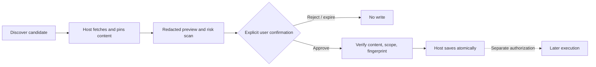

# Approval-First Import

[中文](./README.md) | [English](./README_EN.md)

Approval-First Import is a zero-dependency Node.js library that establishes an explicit, auditable user-approval gate before an application saves an untrusted Skill or MCP configuration. It provides content-bound approval, redacted previews, risk findings, expiration, scope binding, and single-use confirmation.

The core question is not “how can installation be faster?” but “how can users understand what will happen before external capabilities are saved?” Search results never become drafts automatically, previews never write files, and this package never executes saved configurations.

## When to Use It

Importing third-party agent capabilities crosses several trust boundaries:

- Discovery metadata is not an installable configuration.
- A preview is not consent.
- Consent should bind to exact content and scope, not a mutable URL.
- Saving configuration is not permission to execute a command.
- High-risk commands require an additional acknowledgement.
- Failed or ambiguous saves must not replay an old approval automatically.

Approval-First Import turns these boundaries into a reusable state machine for host applications.

## Safety Flow



Execution always remains a separate operation and authorization. This package never runs an external command.

## Quick Start

Requires Node.js 22 or newer. No dependency installation, model key, network access, or build step is required.

```bash
git clone https://github.com/liulinlin718-netizen/approval-first-import.git
cd approval-first-import

node bin/approval-first-import.js demo
node bin/approval-first-import.js preview examples/skill.json
node bin/approval-first-import.js preview examples/mcp-high-risk.json
```

The CLI prints previews only. It exposes no save, install, confirm, or shell command. Integrate the library into a trusted backend for the full confirmation flow.

## Integration

```js
import { ImportApprovalGate } from './src/index.js';

const gate = new ImportApprovalGate({
  ttlMs: 5 * 60_000,
  recordDecision: async decision => auditStore.append(decision),
});

// Build this in trusted host code after safely fetching pinned content.
const draft = {
  kind: 'mcp',
  name: 'Notes',
  source: {
    url: 'https://example.org/notes',
    revision: 'pinned-revision',
  },
  destination: 'config/notes.json',
  transport: 'stdio',
  commands: [{ executable: 'node', args: ['notes-server.mjs'] }],
  env: { NOTES_TOKEN: 'user-supplied-value' },
};

const scope = `${authenticatedUser.id}:${workspace.id}`;
const preview = gate.preview(draft, { scope });

// Send only the redacted preview to the UI; retain the draft on the host.
const receipt = await gate.confirmAndSave({
  previewId: preview.previewId,
  fingerprint: preview.fingerprint,
  scope,
  candidate: currentHostDraft,
  confirmed: userForm.confirmed === true,
  acknowledgeHighRisk: userForm.acknowledgeHighRisk === true,
}, async (approved, decision) => {
  return configStore.saveAtomically(decision.previewId, approved);
});
```

Authentication, CSRF protection, audit storage, content fetching, and atomic persistence belong to the host application. A model-generated `confirmed: true` is not human consent.

## Safety Contract

Every preview contains these literal values:

```json
{
  "requiresConfirmation": true,
  "willWrite": false,
  "willExecute": false
}
```

Approval binds to the normalized candidate, source URL and pinned revision, destinations and file contents, structured command descriptions, hidden environment and header values, user/workspace scope, preview lifetime, and one-time state. Any meaningful change invalidates the old approval.

The save callback receives the frozen original candidate, not an object reconstructed from the public preview.

## Public API

| Operation | Purpose |
| --- | --- |
| `discoveryCandidate(input)` | Validate discovery metadata only; never fetch content or construct commands. |
| `new ImportApprovalGate(options?)` | Create a bounded in-memory approval registry. |
| `gate.preview(candidate, { scope })` | Create a frozen redacted preview and content fingerprint. |
| `gate.confirmAndSave(request, save)` | Verify consent, content, scope, expiry, and risk acknowledgement before one save. |
| `gate.status(previewId, { scope })` | Read the current approval state. |
| `gate.revoke(previewId, { scope })` | Revoke a pending approval. |

Candidates may be multi-file text Skills or MCP configurations with structured stdio commands or HTTP/SSE endpoints. Unknown fields, accessors, cycles, prototype keys, oversized values, and unsafe portable destinations are rejected.

## Redaction and Risk Findings

Public previews hide environment and header values, URL query values and fragments, common credential arguments, bearer values, and credential-like file contents. Empty required values appear as `[REQUIRED]`.

Risk findings cover command declarations, shell or inline-code execution, remote-script pipes, destructive commands, lifecycle scripts, privilege changes, and executable-looking resources. Every external import starts at least at `medium`; `high` requires an additional acknowledgement but still does not authorize execution.

Redaction is a conservative defense, not a complete secret scanner or malicious-code detector. Always render imported content as text, never as trusted HTML.

## State Model and Host Responsibilities

```text
pending → confirming → saving → saved
   │           │           └→ failed
   │           ├→ expired / revoked / failed
   └→ expired / revoked
```

Concurrent confirmations cannot invoke the save callback twice. A failed save consumes the approval because a partial write may have occurred; there is no automatic retry or rollback.

This library does not provide authentication, package discovery, SSRF protection, sandboxing, filesystem isolation, business-schema validation, immutable audit storage, or command execution. The host must pin the bytes shown in the preview, constrain network and destination access, save atomically, and authorize later MCP or script execution separately.

Approval state is process-local. Restarting requires a new preview; persisted audit records must never recreate live permission.

## Tests and Contributing

```bash
node --test
```

Tests use synthetic local fixtures and perform no network requests, model calls, package installation, or tool execution. Reproducible reports and security-boundary proposals are welcome in [Issues](https://github.com/liulinlin718-netizen/approval-first-import/issues).

## License

[MIT License](./LICENSE). This project was extracted from TAgent's separation of discovery, import preview, explicit confirmation, and execution authorization. See [NOTICE](./NOTICE) for provenance.
